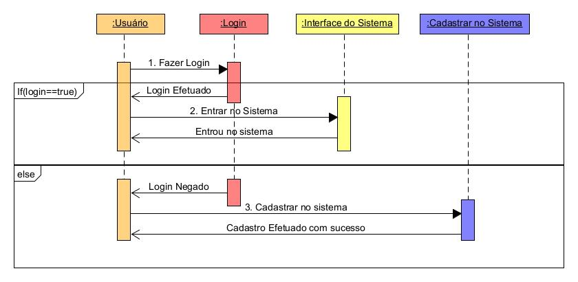

# Apito Final

#### 🚧  Apito Final - Em construção...  🚧

> Atividades esportivas são importantes para a saúde, ajudando na prevenção e no combate de várias doenças como a depressão. É muito comum a realização de práticas esportivas em grupo, as vezes os amigos gostam de competir para tornar a atividade esportiva mais interessante. A organização e o acompanhamento de uma competição esportiva pode ser mais prática com um programa para gerenciar o torneio, partindo desses principios surge o **Apito Final**.

### Tela de Login

[Acesse ao deploy da aplicação](https://apitofinal.vercel.app/)
### Requisitos
Os requisítos para rodar o projeto no seu computador de forma correta, são:
- VS Code - [Link do download](https://code.visualstudio.com/#alt-downloads)
  - Styled Components Plugin - [Link do download](https://marketplace.visualstudio.com/items?itemName=styled-components.vscode-styled-components)
- React JS - [Como utilizar](https://create-react-app.dev/docs/adding-typescript/)
- Node JS - [Link do download](https://nodejs.org/en/download/)
- MySQL Workbench - [Link do download](https://dev.mysql.com/downloads/workbench/)
- GIT - [Link do download](https://git-scm.com/downloads)
- Figma - [Link para Visualização](https://www.figma.com/file/cU85A0PsPe4UMPK4VAe5Bj/Apito-Final---Vers%C3%A3o-WEB-(Copy)?node-id=32%3A9)
- Banco de Dados - [Link](https://drive.google.com/drive/u/0/folders/1umx6lOUSFbz543qr8jgCKt5qRFCWtKKd)
  

### 🛠 Tecnologias

As seguintes ferramentas foram usadas na construção do projeto:
- React JS
- NODE JS
- TypeScript
- Styled Components
- React Router Dom
- GIT
- Figma
### Funcionalidades

- [ ] Login
- [ ] Protótipos 
- [ ] Cadastrar
- [ ] Home - Cadastrar Campeonato
- [ ] Cadastrar Campeonato
- [ ] Seleção dos Times
- [ ] Cadastrar Time
- [ ] Selecionar Campeonato
- [ ] Partidas

### Diagramas
#### Diagrama de Sequência

#### Diagrama de Transição de Dados

#### UML Pacote

#### Diagrama de Casos de Uso
_page-0001.jpg)

#### Diagrama de Classes

### Desenvolvedores
<table>
<tr>
    <td align="center"><a href="https://github.com/zairobastos"> <b>Zairo Bastos</b></a> 
💻
</td>
    <td align="center"><a href="https://github.com/gabrielrudan"> <b>Gabriel Rudan</b></a> 
💻
</td>
    <td align="center"><a href="https://github.com/leh-torres"> <b>Letica Torres</b></a> 
💻
</td>
    <td align="center"><a href="https://github.com/Raylander524"> <b>Raylander</b></a> 
💻
</td>
  </tr>
</table>

### Lincença
[MIT](https://github.com/leh-torres/ApitoFinal2/blob/main/LICENSE)
